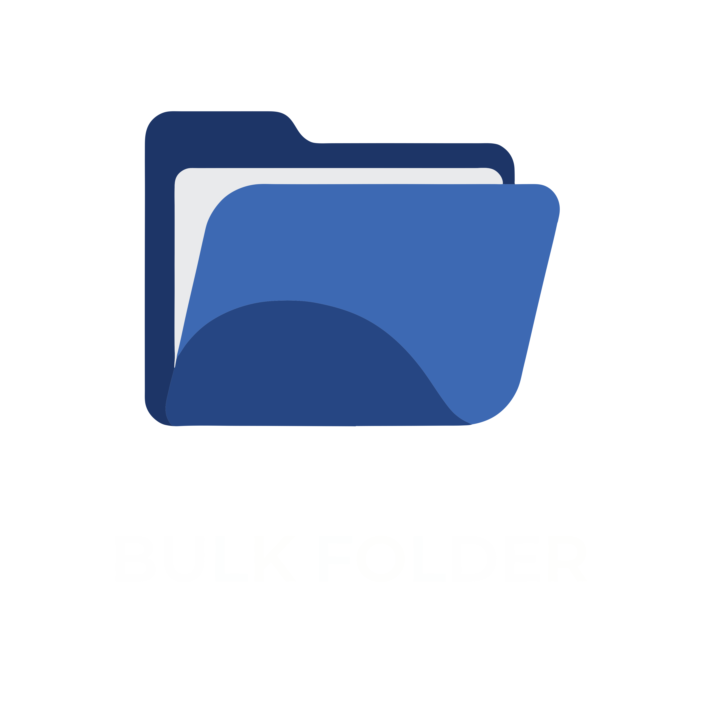
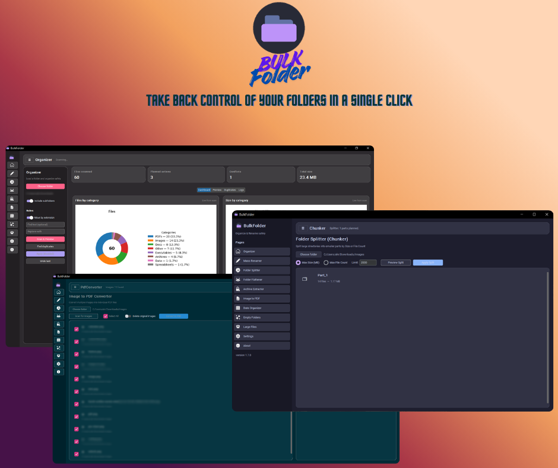

# BulkFolder

**BulkFolder** is a desktop software application designed to organize, clean up, and mass-rename your files quickly and, most importantly, **safely**. 

<h1 align="center">
  <br>
  <a href="Bulk folder"></a>
  <br>
  Bulk folder
  <br>
</h1>

<h1>
    <br>
    <a href="Bulk folder"></a>
</h1>

Whether you have a chaotic "Downloads" folder, thousands of vacation photos to sort by date, or complex nested directories to clean up, BulkFolder centralizes all the necessary tools in a modern and intuitive interface (powered by CustomTkinter with a dark Dracula theme).

---

## Why use BulkFolder?
Most renaming and sorting scripts apply changes immediately, which can cause irreversible data loss or a massive mess if an error occurs. 

BulkFolder relies on a **Planning system (Planner)**: every action is pre-calculated, scanned for conflicts (e.g., two files that would end up with the exact same name), and presented in a **Preview** before a single modification is written to your drive. Furthermore, a built-in **Journaling system** logs your actions, allowing you to undo the latest operations with a single click.

---

## Detailed Features

The application is divided into several independent modules, all accessible via the sidebar.

### 1. Organizer (Main Sorting Tool)
The core module to bring order to a messy directory.
* **Sort by Extension**: Automatically moves files into categorized subdirectories (e.g., `.jpg` and `.png` go to `Images/`, `.pdf` to `PDFs/`, `.mp4` to `Video/`).
* **Find & Replace**: Search for a specific string across all filenames and replace it (or remove it entirely).
* **Duplicate Detection**: Scans files using a full SHA-256 hash (not just the filename) to identify exact, true duplicates.
* **Dashboard & Logs**: A visual dashboard showing what will be modified, the total data footprint affected, and detailed logs of ongoing processes.

### 2. Mass Renamer
A powerful tool to standardize the names of a batch of files.
* **Prefix / Suffix Addition**: Append or prepend text to the original filename.
* **Automatic Numbering**: Enable this option to append a clean, padded sequence (e.g., `_001`, `_002`, `_003`) to the end of the files.
* *Note: Files are automatically sorted alphabetically under the hood before numbering to guarantee a logical sequence.*

### 3. Folder Flattener (Directory Extractor)
The ultimate solution for downloaded folders containing unnecessary sub-sub-directories.
* **Extraction**: Pulls all files buried deep inside subdirectories and places them directly at the root of the parent folder.
* **Smart Conflict Management**: If two files from different subdirectories happen to share the same name, the Flattener smartly renames them (e.g., `image_1.jpg`) to prevent data overwriting.
* **Automatic Cleanup**: A toggle allows you to automatically delete all subdirectories that are left entirely empty after the extraction process.

### 4. Date Organizer
Ideal for administrative archives, invoices, or raw photography.
* Scans the creation/modification timestamp of your files.
* Automatically generates a folder tree based on your preferred format and moves the files accordingly:
  * `Year` (e.g., `2024/file.jpg`)
  * `Year/Month` (e.g., `2024/01/file.jpg`)
  * `Year/Month/Day` (e.g., `2024/01/15/file.jpg`)

### 5. Large Files Management
A quick disk cleanup tool to free up storage space.
* Define a minimum size threshold (in Megabytes, e.g., `50 MB`).
* The software fetches all files exceeding this weight, sorted from heaviest to lightest.
* **Multiple Selection**: Use checkboxes to select multiple large files and permanently delete them in one click.

### 6. Settings
Customize the application's default behavior.
* Choose the default startup page.
* Toggle auto-scan triggers when selecting a new folder.
* Configure the minimum ignored file size when scanning for duplicates.

---

## Prerequisites & Installation

BulkFolder is written in Python 3. Ensure you have **Python 3.8 or higher** installed on your system.

1. **Clone the repository** (or extract the source code archive):
   ```bash
   git clone https://github.com/Ashraf-Khabar/bulkfolder.git
   cd bulkfolder

2. Create a virtual environment (Recommended):

    ```bash
    python -m venv venv
    # On Windows:
    venv\Scripts\activate
    # On Linux/Mac:
    source venv/bin/activate

3. Install the required dependencies:

    ```bash
    pip install -r src/requirements.txt
    ```

    (Main dependencies include customtkinter for the modern GUI and Pillow (PIL) for image and logo rendering).


## How to run the application?
Once the dependencies are installed, run the following command from the root directory of the project (the folder containing the src/ directory):

``` Bash
python -m src.bulkfolder.ui.main
```
(If your terminal is already inside the src folder, you can simply run: python -m bulkfolder.ui.main)

Upon the very first launch, BulkFolder will automatically generate its own custom logo (assets/logo.png and .ico) and display the splash screen before loading the main interface.

## Architecture & Security (Under the hood)
* The application follows a clean architecture pattern, separating the core domain logic from the user interface (UI).

* scanner.py: Traverses the filesystem using the native pathlib library for strict cross-OS compatibility.

* rules.py: Defines renaming and moving rules independently of the execution context.

* planner.py: Computes the future state and generates a list of instructions (the Plan). It actively detects "Collisions" (if two files are scheduled to land at the exact same path) and blocks execution to secure your data.

* executor.py: Physically applies the plan to the hard drive.

* journal.py / undo.py: At every execution, BulkFolder writes a .bulkfolder_journal.jsonl file in the target directory. This file allows the undo system to safely restore original names and locations by reading the operations in reverse.

## License
This project is licensed under the terms of the LICENSE file included in the repository.


